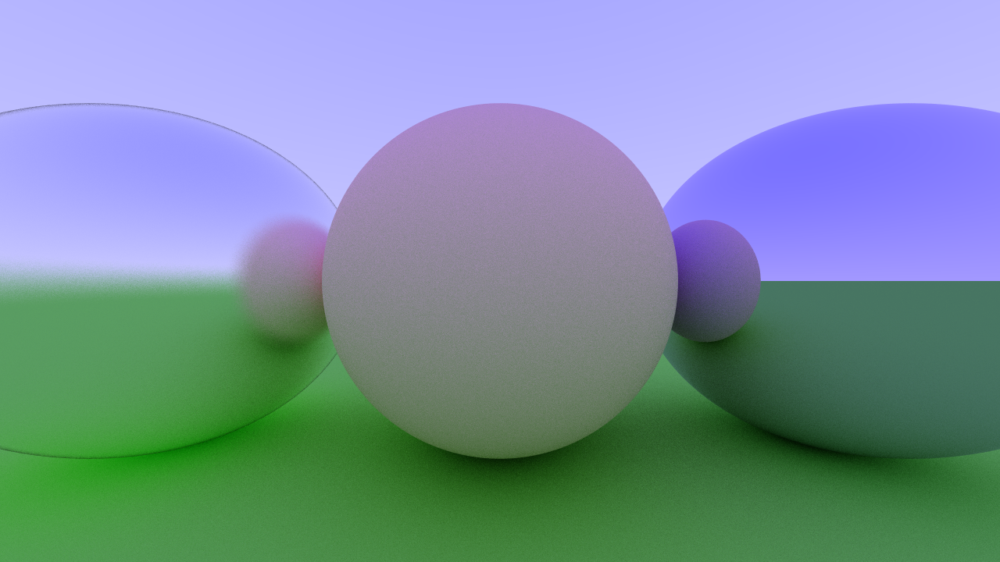

# Go Raytracer

I am implementing a raytracer in Go for fun. It is mostly based on the awesome book [Ray Tracing in a Weekend](http://www.realtimerendering.com/raytracing/Ray%20Tracing%20in%20a%20Weekend.pdf) by Peter Shirley.